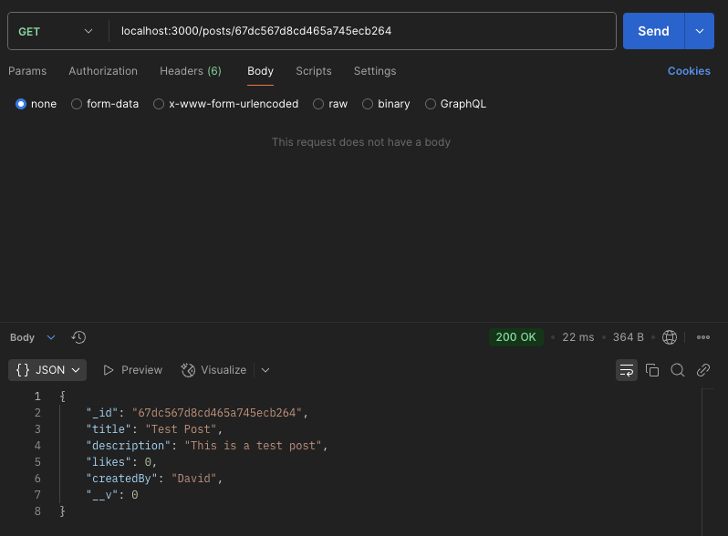

# WD_Assignment2

[Github Repository](https://github.com/d-simmons/WD_Assignment2)

## User Authenitication System Tests

### Register
Successful:

Duplicate User:

Invalid Email:

Invalid Password:

### Login
Successful:

Wrong Password:

User Does Not Exist:

### Posts
Create a post (with auth token):

Get all posts:

Get a single post:

Update a post successfully:

Update a post denied because wrong creator:

Delete a post successfully:

Delete a post denied because wrong creator:

